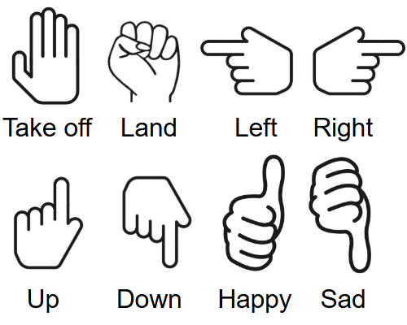

# Crazyflie Interactive Pet

**Transforming the Crazyflie 2.1 Nano-Drone into an Interactive Pet Controlled by Voice and Gestures**

## Overview

This project changes the control of the Crazyflie by enabling natural human interaction using **hand gestures** and **voice commands**, turning the Crazyflie 2.1 nano quadrotor into an **interactive flying pet**. Traditional joystick based drone control is replaced by multimodal input to create a more intuitive and accessible user experience.

As part of a Bachelor Thesis at the Leiden Institute of Advanced Computer Science (LIACS), this project explores the Crazyflie and combines real time gesture recognition (using MediaPipe and K-Nearest Neighbors) and voice command interpretation (via VOSK and NLP) to create an intelligent, interactive pet.

---

## Features

-  **Gesture-based Control**: Real-time gesture recognition using a laptop webcam and MediaPipe Hands.
-  **Voice-based Commands**: Offline voice recognition with VOSK and semantic matching via sentence embeddings.
-  **Interactive Pet Behavior**: Mood states (happy, bored, sad), idle animations, and "trick" learning capability.
-  **Obstacle Avoidance**: Utilizes MultiRanger deck for safe indoor navigation.
-  **Learning Mode**: Users can teach the drone custom tricks via spoken command sequences.

---

## Hardware Requirements

- [Crazyflie 2.1](https://www.bitcraze.io/products/crazyflie-2-1/)
- [Crazyradio 2.0](https://www.bitcraze.io/products/crazyradio-2-0/)
- [Flow Deck v2](https://www.bitcraze.io/products/flow-deck-v2/)
- [MultiRanger Deck](https://www.bitcraze.io/products/multi-ranger-deck/)
- USB microphone or built-in laptop microphone
- Webcam (internal or external)

---

## Software Requirements

Python version == 3.10 and the following packages:

```txt
opencv-python
numpy
pandas
joblib
sounddevice
mediapipe
vosk
sentence-transformers
scikit-learn
torch
cflib
```

Install with:

```bash
pip install -r requirements.txt
```
## Usage

1. Plug in the Crazyradio.
2. Ensure the Flow Deck and MultiRanger are attached properly.
3. Run the main script:

```bash
python main.py
```

4. Use gestures (e.g., open palm, fist) or speak commands like:

   - “Take off”
   - “Go forward two meters”
   - “Land”
   - “Spin”
   - “Learn a new trick” → “happy spin” → [series of commands] → “End trick”

---

## The Gestures Implemented


---

## Acknowledgements

This work was developed as a Bachelor Thesis by **Ernie Tsie-A-Foeng**, supervised by **Mike Preuss** at Leiden University (LIACS).

---

## License

Distributed under MIT.
